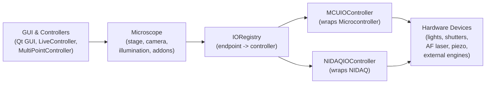

## Reorganize IO Routing Between Teensy and NI‑DAQ

### 1. Define a unified IO configuration model

- **Introduce IO endpoint abstraction**: Design a small schema (e.g. in a new YAML such as `[control/core]/io_endpoints.yaml`) that defines logical hardware endpoints (e.g. `illum_488_shutter`, `illum_488_intensity`, `af_laser_gate`, `camera_trigger`, `cellx_mod_in`) with:
  - **controller**: `"MCU"` (Teensy) or `"NIDAQ"` (or future `"External"`/`"None"`),
  - **type**: `"digital"` or `"analog"`,
  - **direction**: `"output"`/`"input"`,
  - **controller_channel_id**: string like `"D1"`, `"DAC7"`, `"Dev1/port0/line2"`, `"Dev1/ao0"`,
  - optional **role/semantic** tag (e.g. `"camera_trigger"`, `"shutter"`, `"intensity"`).
- **Integrate with existing config**: Extend `ConfigRepository` and/or `NIDAQ_CONFIG` (`control/_def.py`) to load this IO schema once at startup, and keep backward compatibility by generating default endpoint mappings that mirror current hardcoded wiring (MCU‑based illumination ports, AF laser pin, camera trigger, etc.).
- **Ensure single‑controller choice per endpoint**: Validate on load that each logical endpoint is mapped to exactly one controller (Teensy or NI‑DAQ) and fail fast if config attempts to assign both.

### 2. Add IO controller interfaces and registry

- **Define `AbstractIOController`** (e.g. in a new `control/core/io_controller.py`) exposing operations used by higher layers:
  - `set_digital(level, endpoint)` / `pulse_digital(endpoint, width_us, delay_us)`,
  - `set_analog(volts_or_percent, endpoint)` / `set_waveform(endpoint, waveform, sample_rate_hz)`,
  - optional `arm_for_acquisition(config)` / `start_trigger()` for synchronized tasks.
- **Implement `MCUIOController` wrapper** around `Microcontroller` using the new endpoint metadata:
  - Map `endpoint.controller_channel_id` onto existing MCU APIs: `turn_on_illumination`, `set_illumination`, multi‑port APIs, `set_pin_level`, `send_hardware_trigger`, `set_piezo_um`, etc.
- **Implement `NIDAQIOController`** backed by the existing `NIDAQ` class:
  - Manage AO/DO/AI/DI waveforms and live DC outputs using endpoint metadata to fill `NIDAQ_CONFIG.ao_channels`, `do_port/do_lines`, and live output helpers.
- **Create an `IORegistry` / `HardwareRouting` singleton** constructed once at startup:
  - builds `MCUIOController` and/or `NIDAQIOController` based on config flags like `ENABLE_NIDAQ` / `SIMULATE_NIDAQ`,
  - exposes a simple `get_digital_endpoint(name)` / `get_analog_endpoint(name)` that returns a `(controller, endpoint_metadata)` pair for use by higher‑level device controllers.

### 3. Refactor illumination and device controllers to use IO endpoints

- **Adapt `IlluminationController` (`lighting.py`)** to work in terms of logical endpoints:
  - For Squid‑style DAC+TTL lights, look up `illum_X_intensity` (analog) and `illum_X_shutter` (digital) endpoints through the `IORegistry` and call the appropriate controller rather than directly invoking `Microcontroller.set_illumination`/`turn_on_illumination`.
  - For devices with software intensity but TTL shutter (e.g. CELESTA, Andor lasers), keep intensity via existing serial/Ethernet APIs but route shutter to the configured TTL endpoint (MCU or NI‑DAQ) using the IO abstraction.
  - Preserve multi‑port firmware capabilities by treating each D‑port as its own logical analog+digital endpoint and mapping them to firmware multi‑port commands only when the controller is `MCU`.
- **Treat external‑modulation‑capable devices as IO consumers**:
  - For `CellX`, `LDI` in `EXT Analog`/`EXT Digital` or mixed modes, represent their modulation pins (analog/TTL) as IO endpoints (`cellx_ch1_mod`, etc.) in the config and drive them via the chosen controller.
- **Ensure live‑mode support**: For any endpoint, define a simple API (e.g. `set_static_level`, `enable_live_output`) so that live illumination and gating work identically regardless of MCU vs NI‑DAQ backend.

### 4. Unify trigger and synchronized acquisition routing

- **Abstract camera trigger routing**:
  - Introduce a `CameraTriggerConfig` (e.g. in `microscope.py` or a new `camera_trigger.py`) that describes how the camera should be triggered: software mode, or hardware mode with a specific logical trigger endpoint (`camera_trigger_out`) and optional strobe delay.
  - Replace the current inline `acquisition_camera_hw_trigger_fn` in `Microscope.build_from_global_config` with one that calls into the IO abstraction: e.g. `io_registry.send_camera_trigger(illumination_time_ms)` which then uses either `MCUIOController.send_hardware_trigger(...)` or an NI‑DAQ DO pulse.
- **Hook NI‑DAQ devices into synchronized acquisitions**:
  - When a device’s shutter/intensity endpoints are assigned to `NIDAQ`, ensure they are included in the waveform construction path in `NIDAQ.set_waveforms` (e.g. DO lines for shutter pulses aligned with the camera trigger, AO channels for intensity ramps).
  - Extend the existing `WaveformData` / `AcquisitionResult` structures to include metadata tying waveforms back to logical endpoints, making it easy for acquisition code to set patterns based on high‑level acquisition parameters rather than hard‑coding NI channel names.
- **Align GUI acquisition paths**:
  - Update `MultiPointController` / `QtMultiPointController` to configure synchronized IO via the new IO abstraction (e.g. `io_registry.prepare_synchronized_acquisition(acq_params)`), leaving the GUI unaware of MCU vs NI‑DAQ specifics.

### 5. Clean up and standardize the camera interface

- **Centralize camera creation and trigger capabilities**:
  - Audit camera modules (e.g. `camera.py`, `camera_flir.py`, `camera_tucsen.py`) and standardize an `AbstractCamera` interface around:
    - trigger mode enum (software vs hardware vs continuous),
    - method to set hardware trigger input source (if applicable) and polarity,
    - methods for exposure/ROI/bit depth that do not leak vendor‑specific details up to `Microscope`.
- **Move camera‑specific trigger wiring into config**:
  - Add config entries describing whether the camera’s hardware trigger input is wired to the MCU or NI‑DAQ, and which logical endpoint corresponds to that input (e.g. `camera_trigger_in`), so `Microscope.build_from_global_config` can set the correct acquisition mode and rely on IO routing for actual pulses.
- **Simplify `Microscope` trigger logic**:
  - Reduce the `Microscope` class’s trigger responsibilities to choosing between `CameraAcquisitionMode.SOFTWARE_TRIGGER`/`HARDWARE_TRIGGER`/`CONTINUOUS` and delegating actual pulse generation/strobe delays to IO controllers.

### 6. Ensure extensibility and migration safety

- **Gradual migration path**:
  - Provide default endpoint mappings that exactly reproduce current behavior (all TTL/analog routed to MCU, NI‑DAQ disabled unless explicitly configured).
  - Add a validation helper that logs a clear summary at startup: for each logical device endpoint, report which controller and line it is mapped to, helping users verify physical wiring matches configuration.
- **Extensibility hooks**:
  - Design endpoint naming and `AbstractIOController` APIs so new controllers (e.g. another DAQ brand, FPGA, or a second MCU) can be added by implementing the interface and adding a new `controller` enum value without touching GUI or acquisition logic.
  - Keep hardware‑specific details (serial protocols, firmware quirks) isolated in existing low‑level modules (`microcontroller.py`, `serial_peripherals.py`, `ni_daq.py`) and in the small IO controller wrappers.

### 7. High‑level architecture sketch

## Todos

- **config-model**: Design and document the new IO endpoint configuration format (logical endpoints, controller selection, and controller‑specific channel IDs) and integrate it with the existing config loading (`ConfigRepository`, `NIDAQ_CONFIG`, `control._def`).
- **io-abstraction**: Implement `AbstractIOController`, `MCUIOController`, `NIDAQIOController`, and an `IORegistry` that resolves logical endpoints to concrete IO operations at startup.
- **illumination-refactor**: Refactor `IlluminationController` and IO‑using device wrappers (LDI, CellX, SciMicroscopy LED array, AF laser, piezo) to use IO endpoints instead of directly calling `Microcontroller`/`NIDAQ` or hard‑coded pins.
- **sync-triggering**: Rework camera trigger routing and synchronized acquisition setup so that both camera and NI‑DAQ‑connected devices use the same logical trigger endpoints and waveform descriptions, regardless of whether pulses come from Teensy or NI‑DAQ.
- **camera-interface-cleanup**: Standardize the camera abstraction for trigger modes and hardware trigger inputs, moving wiring details into config and simplifying `Microscope.build_from_global_config` and related trigger setup code.
- **migration-validation**: Add startup validation and logging that summarize per‑endpoint routing, and provide migration defaults that preserve existing MCU‑only behavior when no IO endpoint config is present.

