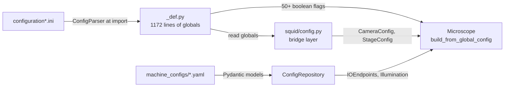
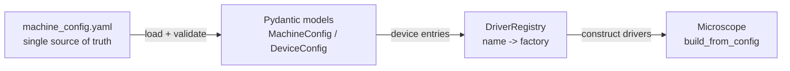
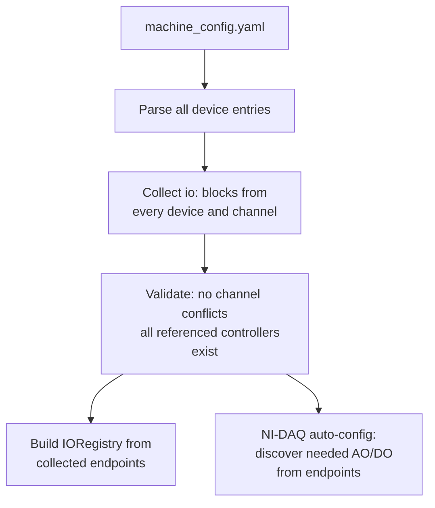

# Unified Microscope Configuration

## Current State

Configuration is scattered across four systems with no single source of truth:

1. `**configuration_Squid+_NIDAQ_test.ini**` -- flat INI file with ~260 lines mixing hardware parameters (motor currents, screw pitches), software preferences (display crop, tracking), and device selection (camera type, controller version)
2. `**control/_def.py**` -- 1172 lines of module-level constants, loaded at import time by exec-ing the INI into `locals()`. Contains ~50 boolean device flags (`USE_*`, `ENABLE_*`, `SIMULATE_*`), enums, dataclasses, and utility functions all interleaved
3. `**machine_configs/*.yaml**` -- newer Pydantic-backed YAML files for illumination channels, IO endpoints, filter wheels, cameras (well-structured, but disconnected from the INI/`_def.py` world)
4. `**squid/config.py**` -- bridge layer that reads `_def.py` globals into `CameraConfig`, `StageConfig`, `FilterWheelConfig` dataclasses



### Problems

- Adding a device requires touching `_def.py` (flags + constants), the INI file (values), `microscope.py` (construction logic), and sometimes `squid/config.py`
- `_def.py` uses a fragile pattern of matching `locals()` to INI keys at import time
- No way to describe "this microscope has these devices" -- instead, ~50 scattered boolean flags are set independently
- Hardware parameters (motor currents, screw pitches, encoder settings) are mixed with GUI preferences (display crop, napari settings) and acquisition defaults
- Device construction in `microscope.py` is a long chain of `if control._def.USE_X` branches

## Target Architecture



### Single configuration file: `machine_configs/machine_config.yaml`

One YAML file describes the entire machine. It is organized into clear sections matching the categories of information it contains.

#### Key design principle: IO endpoints are owned by devices, not by controllers

Low-level controllers (Teensy, NI-DAQ) do **not** pre-declare their available channels. Instead, each device that uses an IO line declares it inline via an `io:` block. At startup the system collects all `io:` declarations across all device entries and:

1. Groups them by controller name (matching a device entry like `teensy` or `nidaq`)
2. Validates there are no channel conflicts (two devices claiming the same line)
3. Builds the `IORegistry` with the collected endpoints
4. For NI-DAQ, auto-discovers which AO/DO channels are needed from the collected set

This eliminates the separate `io_endpoints.yaml` file. The wiring information lives where it is most meaningful -- on the device that uses the line.

```yaml
version: 3.0

# ============================================================
# DEVICES -- declarative hardware inventory
# ============================================================
# Each device entry specifies:
#   driver:       registered driver name (maps to a Python class)
#   enabled:      whether to construct this device (default true)
#   simulate:     whether to use the simulation variant (default false)
#   connection:   how to reach it (serial, ethernet, USB HID, etc.)
#   config:       driver-specific parameters
#   io:           IO lines this device uses (controller + channel_id)

devices:

  # -- Low-level controllers ----------------------------------
  # These only declare connection info and controller-global settings.
  # They do NOT list available channels -- those are populated from
  # the io: blocks of every other device that references them.

  teensy:
    driver: teensy
    connection:
      serial_number: "ABC123"    # or port: COM3
    config:
      illumination_intensity_factor: 0.6
      output_gains:
        refdiv: false
        channels: [false, false, false, false, false, false, false, true]

  nidaq:
    driver: nidaq
    config:
      device_name: "Dev1"
      sample_rate: 100000
      # No ao_channels / do_lines here -- they are discovered from
      # the io: blocks of devices that reference nidaq.

  # -- Cameras ------------------------------------------------
  main_camera:
    driver: toupcam          # or daheng, flir, hamamatsu, andor, ...
    role: main
    connection:
      model: "ITR3CMOS26000KMA"
    io:
      trigger:
        controller: teensy
        signal_type: digital
        direction: output
        channel_id: "trigger:0"
    config:
      pixel_format: MONO16
      binning: 2
      roi: { offset_x: 0, offset_y: 0, width: 6224, height: 4168 }
      crop: { width: 4168, height: 4168 }
      rotate_angle: null
      flip: null
      temperature: 20

  focus_camera:
    driver: daheng
    role: focus
    connection:
      model: "MER2-630-60U3M"
    config:
      exposure_time_ms: 0.8

  # -- Stage ---------------------------------------------------
  stage:
    driver: cephla           # or prior
    controller: teensy       # reference to device above
    config:
      x: { fullsteps_per_rev: 200, screw_pitch_mm: 2.54, microstepping: 16,
           motor_rms_current_ma: 1000, i_hold: 0.25,
           max_velocity_mm: 30, max_acceleration_mm: 500,
           movement_sign: 1, pos_sign: 1,
           homing_enabled: true, home_switch_polarity: 1,
           scan_stabilization_time_ms: 25 }
      y: { ... }    # same structure
      z: { fullsteps_per_rev: 200, screw_pitch_mm: 0.3, microstepping: 16,
           motor_rms_current_ma: 500, i_hold: 0.5,
           max_velocity_mm: 3.8, max_acceleration_mm: 100,
           movement_sign: -1, pos_sign: -1,
           homing_enabled: true, home_switch_polarity: 0,
           scan_stabilization_time_ms: 20,
           motor_config: stepper }   # stepper, stepper+piezo, piezo, linear
      encoders:
        x: { enabled: false, has_encoder: false }
        y: { enabled: false, has_encoder: false }
        z: { enabled: false, has_encoder: false }
      pid:
        x: { enabled: false }
        y: { enabled: false }
        z: { enabled: false }
      software_limits:
        x: { positive: 115, negative: 5 }
        y: { positive: 76, negative: 4 }
        z: { positive: 6, negative: 0.05 }
      positions:
        loading: { x_mm: 0.5, y_mm: 0.5 }
        scanning: { x_mm: 20, y_mm: 20 }
        default_z_mm: 2.287

  # -- Illumination -------------------------------------------
  # Channels are listed under the light source device. Each channel
  # declares its own IO lines -- intensity may go through MCU analog,
  # NI-DAQ analog, or serial; shutter may go through MCU digital,
  # NI-DAQ digital, or serial. This replaces both io_endpoints.yaml
  # and illumination_channel_config.yaml for wiring purposes.

  illumination:
    driver: squid_builtin    # or coolled_pe400, ldi, celesta, andor_laser
    channels:
      405nm:
        wavelength_nm: 405
        io:
          intensity:
            controller: teensy
            signal_type: analog
            direction: output
            channel_id: "port:0"
          shutter:
            controller: teensy
            signal_type: digital
            direction: output
            channel_id: "port:0"
      488nm:
        wavelength_nm: 488
        io:
          intensity:
            controller: teensy
            signal_type: analog
            direction: output
            channel_id: "port:1"
          shutter:
            controller: teensy
            signal_type: digital
            direction: output
            channel_id: "port:1"
      561nm:
        wavelength_nm: 561
        io:
          intensity:
            controller: teensy
            signal_type: analog
            direction: output
            channel_id: "port:2"
          shutter:
            controller: teensy
            signal_type: digital
            direction: output
            channel_id: "port:2"

  # Example: coolLED hybrid (serial intensity + NI-DAQ TTL shutter)
  # coolled:
  #   driver: coolled_pe400
  #   connection:
  #     serial_number: "..."
  #   channels:
  #     A:
  #       wavelength_nm: 635
  #       io:
  #         intensity:
  #           controller: serial     # via USB serial commands
  #           channel_id: "coolled:A"
  #         shutter:
  #           controller: nidaq      # fast TTL
  #           signal_type: digital
  #           direction: output
  #           channel_id: "port0/line5"
  #     B:
  #       wavelength_nm: 488
  #       io:
  #         intensity:
  #           controller: serial
  #           channel_id: "coolled:B"
  #         shutter:
  #           controller: nidaq
  #           signal_type: digital
  #           direction: output
  #           channel_id: "port0/line6"

  # led_matrix:
  #   driver: scimicroscopy_led_array
  #   connection:
  #     serial_number: "..."
  #   config:
  #     distance: 50
  #     default_na: 0.8
  #     turn_on_delay: 0.03

  # -- Confocal -----------------------------------------------
  # xlight:
  #   driver: xlight
  #   connection:
  #     serial_number: "B00031BE"
  #   config:
  #     sleep_time_for_wheel: 0.25

  # -- Autofocus ----------------------------------------------
  laser_af:
    enabled: true
    io:
      laser_gate:
        controller: teensy
        signal_type: digital
        direction: output
        channel_id: "pin:15"
    config:
      spot_detection_mode: dual_left

  # -- Objective piezo ----------------------------------------
  piezo:
    driver: objective_piezo
    io:
      output:
        controller: teensy
        signal_type: analog
        direction: output
        channel_id: "dac:7"
    config:
      range_um: 300
      home_um: 150
      control_voltage_range: 10
      flip_direction: false

# ============================================================
# ILLUMINATION CHANNELS -- display names, calibration, LED matrix
# ============================================================
# Channel *wiring* is now in the device entries above.
# This file provides supplementary info: display names, LED matrix
# patterns, intensity calibration CSVs, excitation filter mappings.
# Can be inlined or kept as a separate file.
illumination_channels_file: illumination_channel_config.yaml

# ============================================================
# SOFTWARE / GUI SETTINGS
# ============================================================
software:
  is_hcs: true
  wellplate_format: 384
  inverted_objective: true
  default_saving_path: "/Downloads"
  display:
    default_crop: 85
    use_napari_for_live_view: false
    use_napari_for_mosaic: true
  acquisition:
    image_format: bmp
    scaling_factor: 0.85
    dx: 0.9
    dy: 0.9
    dz: 1.5
    fovs_per_af: 3
    flexible_multipoint: true
    wellplate_multipoint: false
    recording: true
    fast_acquisition: true
    default_nx: 1
    default_ny: 1
  autofocus:
    channel: "BF LED matrix full"
    enable_by_default: false
    bf_saving_option: "Green Channel Only"
    stop_threshold: 0.85
    crop: { width: 800, height: 800 }
  tracking:
    enabled: false
    default_tracker: csrt
  optics:
    tube_lens_mm: 180
  plate_reader:
    rows: 8
    columns: 12
    row_spacing_mm: 9
    column_spacing_mm: 9
    offset_column_1_mm: 20
    offset_row_a_mm: 20
  wellplate_384:
    upper_left_x_mm: 12.41
    upper_left_y_mm: 11.18
    offset_x_mm: 0
    offset_y_mm: 0
```

#### How IO endpoint collection works at startup



Each `io:` entry in the YAML becomes an `IOEndpoint` in the registry, with the endpoint name auto-generated from the device name and io key (e.g. device `main_camera`, io key `trigger` becomes endpoint name `main_camera.trigger`; device `illumination`, channel `488nm`, io key `shutter` becomes `illumination.488nm.shutter`).

The NI-DAQ controller inspects its collected endpoints to determine which physical AO channels and DO lines it needs to configure, rather than having them pre-declared.

### Driver registry and factory pattern

Instead of `if control._def.USE_COOLLED ... elif control._def.USE_LDI ...` chains in `microscope.py`, a registry maps driver names to classes:

```python
# control/core/driver_registry.py
_REGISTRY: Dict[str, Tuple[Type, Optional[Type]]] = {}
# Maps driver name -> (real_class, simulation_class)

def register_driver(name: str, cls, sim_cls=None):
    _REGISTRY[name] = (cls, sim_cls)

def get_driver_class(name: str, simulate: bool = False):
    real_cls, sim_cls = _REGISTRY[name]
    if simulate and sim_cls:
        return sim_cls
    return real_cls

# Registrations happen at import time in each driver module:
# In camera_toupcam.py:
#   register_driver("toupcam", ToupcamCamera, ToupcamCamera_Simulation)
# In serial_peripherals_coolled.py:
#   register_driver("coolled_pe400", CoolLEDpE400, CoolLEDpE400_Simulation)
```

Construction becomes data-driven:

```python
for device_name, device_cfg in machine_config.devices.items():
    cls = get_driver_class(device_cfg.driver, simulate=device_cfg.simulate)
    instance = cls(**device_cfg.connection, **device_cfg.config)
```

### Device abstraction hierarchy

Existing ABCs are already well-structured. The main gaps to fill:

- `**AbstractCamera**` -- already exists in `squid/abc.py`, well-defined
- `**AbstractStage**` -- already exists in `squid/abc.py`
- `**AbstractFilterWheelController**` -- already exists in `squid/abc.py`
- `**LightSource**` -- already exists in `squid/abc.py`
- `**AbstractConfocalUnit**` -- needs creation (XLight and Dragonfly currently have no shared ABC)
- `**AbstractSpatialModulator**` -- needs creation for future DMD/SLM/galvo devices

Each ABC stays in `squid/abc.py`. Concrete implementations stay in their existing files. The driver registry connects names to classes without requiring centralized knowledge of all implementations.

### Pydantic models for the config

```
control/models/
  machine_config.py          # NEW: MachineConfig, DeviceEntry, SoftwareConfig
  io_endpoint_config.py      # existing (IOEndpoint reused for collected endpoints)
  illumination_config.py     # existing
  ...
```

`MachineConfig` is the root model:

```python
class DeviceConnection(BaseModel):
    type: str = "serial"       # serial, ethernet, usb_hid, ...
    serial_number: Optional[str] = None
    port: Optional[str] = None
    # ... other connection params

class DeviceIOLine(BaseModel):
    """A single IO line declared by a device."""
    controller: str             # references a device name (e.g. "teensy", "nidaq", "serial")
    signal_type: str = "digital"  # "digital" or "analog"
    direction: str = "output"
    channel_id: str             # controller-specific (e.g. "port:0", "ao0", "coolled:A")

class DeviceChannel(BaseModel):
    """A channel within a multi-channel device (e.g. one wavelength of a light source)."""
    wavelength_nm: Optional[int] = None
    io: Dict[str, DeviceIOLine] = {}    # role -> IO line (e.g. "intensity", "shutter")
    # ... other channel-specific config

class DeviceEntry(BaseModel):
    driver: str
    enabled: bool = True
    simulate: bool = False
    role: Optional[str] = None           # e.g. "main", "focus" for cameras
    controller: Optional[str] = None     # reference to another device (e.g. stage -> teensy)
    connection: Optional[DeviceConnection] = None
    io: Dict[str, DeviceIOLine] = {}     # device-level IO lines (e.g. camera trigger, piezo output)
    channels: Dict[str, DeviceChannel] = {}  # for multi-channel devices (light sources)
    config: Dict[str, Any] = {}          # driver-specific parameters

class SoftwareConfig(BaseModel):
    is_hcs: bool = False
    wellplate_format: int = 384
    # ... all the non-hardware settings

class MachineConfig(BaseModel):
    version: float = 3.0
    devices: Dict[str, DeviceEntry] = {}
    illumination_channels_file: Optional[str] = "illumination_channel_config.yaml"
    software: SoftwareConfig = SoftwareConfig()

    def collect_io_endpoints(self) -> List[IOEndpoint]:
        """Walk all devices and channels, collect io: declarations into IOEndpoints."""
        endpoints = []
        for dev_name, dev in self.devices.items():
            # Device-level IO (e.g. main_camera.trigger, piezo.output)
            for io_key, io_line in dev.io.items():
                endpoints.append(IOEndpoint(
                    name=f"{dev_name}.{io_key}",
                    controller=io_line.controller,
                    signal_type=io_line.signal_type,
                    direction=io_line.direction,
                    channel_id=io_line.channel_id,
                    role=io_key,
                ))
            # Channel-level IO (e.g. illumination.488nm.shutter)
            for ch_name, ch in dev.channels.items():
                for io_key, io_line in ch.io.items():
                    endpoints.append(IOEndpoint(
                        name=f"{dev_name}.{ch_name}.{io_key}",
                        controller=io_line.controller,
                        signal_type=io_line.signal_type,
                        direction=io_line.direction,
                        channel_id=io_line.channel_id,
                        role=io_key,
                    ))
        return endpoints
```

### Migration strategy

This is a large change. The phased approach:

**Phase 1: Config model + loader (no behavior change)**

- Create `MachineConfig` Pydantic model and `machine_config.yaml`
- Add `ConfigRepository.get_machine_config()` to load it
- Generate a `machine_config.yaml` from the current INI + `_def.py` defaults for existing setups
- Everything still works via `_def.py`; the new YAML is loaded in parallel for validation

**Phase 2: Driver registry + Microscope refactor**

- Create `DriverRegistry` with registration decorators
- Register all existing drivers (cameras, stages, light sources, peripherals)
- Refactor `Microscope.build_from_global_config` to read from `MachineConfig.devices` instead of `_def.py` boolean flags
- `_def.py` flags become computed from `MachineConfig` for backward compatibility

**Phase 3: Absorb remaining INI settings**

- Move stage config, camera config, software settings from INI/`_def.py` into `machine_config.yaml`
- `squid/config.py` bridge reads from `MachineConfig` instead of `_def.py` globals
- INI file becomes optional (legacy compat only)

**Phase 4: Cleanup**

- Remove INI loading code from `_def.py`
- Slim `_def.py` to only contain enums, protocol constants, and hardware command definitions
- Remove `squid/config.py` bridge (everything reads from `MachineConfig`)

### What stays as separate files

- `**illumination_channel_config.yaml`** -- supplementary info (display names, LED matrix patterns, intensity calibration CSVs, excitation filter mappings) that doesn't belong in the wiring config. Channel *wiring* (which controller and channel_id) moves into the device's `io:` blocks in `machine_config.yaml`.
- `**filter_wheels.yaml`**, `**cameras.yaml`** -- these registries might eventually fold into `machine_config.yaml` device entries, but can stay separate initially.
- `**user_profiles/`** -- per-user acquisition settings, orthogonal to machine config.

### What goes away

- `**io_endpoints.yaml`** -- replaced entirely by the `io:` blocks distributed across device entries in `machine_config.yaml`. The `IOEndpointConfig` / `IOEndpoint` Pydantic models are still used internally (the `collect_io_endpoints()` method on `MachineConfig` produces them), but they are no longer loaded from a standalone file.